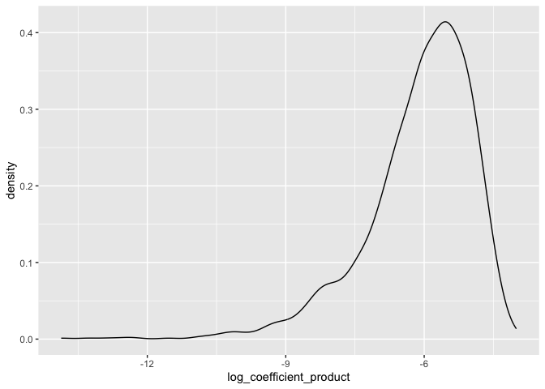
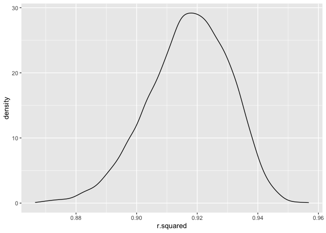
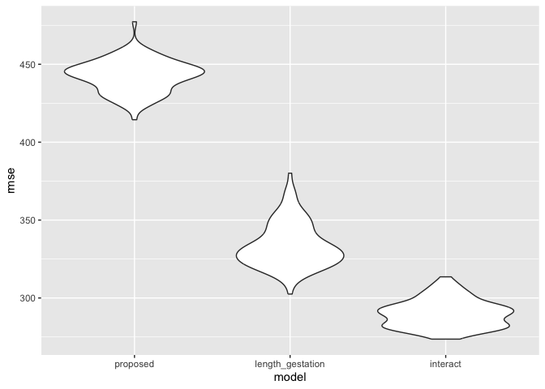

p8105_hw6_yd2739
================
Yuxuan Du
2023-11-17

## Problem 1

``` r
homicides_data = read_csv('https://raw.githubusercontent.com/washingtonpost/data-homicides/master/homicide-data.csv')|>
  mutate(city_state = paste(city, state, sep = ", "))|>
  group_by(city_state)|>
  subset(city_state != "Dallas, TX")|>
  subset(city_state != "Phoenix, AZ")|>
  subset(city_state != "Kansas City, MO")
```

    ## Rows: 52179 Columns: 12
    ## ── Column specification ────────────────────────────────────────────────────────
    ## Delimiter: ","
    ## chr (9): uid, victim_last, victim_first, victim_race, victim_age, victim_sex...
    ## dbl (3): reported_date, lat, lon
    ## 
    ## ℹ Use `spec()` to retrieve the full column specification for this data.
    ## ℹ Specify the column types or set `show_col_types = FALSE` to quiet this message.

``` r
homicides_data_cleaned = homicides_data|>
  mutate(case_solved = ifelse(disposition!="Open/No arrest", 1, 0))|>
  filter(victim_race == "White"|victim_race == "Black")|>
  mutate(victim_age = as.numeric(victim_age))
```

    ## Warning: There were 28 warnings in `mutate()`.
    ## The first warning was:
    ## ℹ In argument: `victim_age = as.numeric(victim_age)`.
    ## ℹ In group 1: `city_state = "Albuquerque, NM"`.
    ## Caused by warning:
    ## ! NAs introduced by coercion
    ## ℹ Run `dplyr::last_dplyr_warnings()` to see the 27 remaining warnings.

``` r
Baltimore_df = homicides_data_cleaned|>
  subset(city_state == "Baltimore, MD")|>
  mutate(victim_race = factor(victim_race))|>
  mutate(victim_sex = factor(victim_sex))

fit_logistic = 
  Baltimore_df|> 
  glm(case_solved ~ victim_age + victim_race + victim_sex, data = _, family = binomial())

fit_logistic|>
  broom::tidy()|> 
  filter(term == "victim_sexMale")|>
  mutate(
    OR = exp(estimate),
    LowerCI = exp(estimate - 1.96 * std.error),
    UpperCI = exp(estimate + 1.96 * std.error)
  )
```

    ## # A tibble: 1 × 8
    ##   term           estimate std.error statistic  p.value    OR LowerCI UpperCI
    ##   <chr>             <dbl>     <dbl>     <dbl>    <dbl> <dbl>   <dbl>   <dbl>
    ## 1 victim_sexMale    -1.04     0.143     -7.26 3.74e-13 0.355   0.268   0.469

``` r
fit_glm_for_city = function(city_data) {
  fit_logistic = glm(case_solved ~ victim_age + victim_race + victim_sex, data = city_data, family = binomial())
  tidy_result = fit_logistic|>
    broom::tidy()|>
    filter(term == "victim_sexMale")|>
    mutate(
      OR = exp(estimate),
      LowerCI = exp(estimate - 1.96 * std.error),
      UpperCI = exp(estimate + 1.96 * std.error)
    )|>
    select(term, OR, LowerCI, UpperCI)
}

result_list = homicides_data_cleaned |>
  mutate(victim_race = factor(victim_race))|>
  mutate(victim_sex = factor(victim_sex))|>
  group_by(city_state) |>
  nest()|>
  filter(city_state != "Tulsa, AL")|>
  mutate(glm_result = map(data, fit_glm_for_city))|>
  unnest(glm_result)
```

``` r
result_list|>
  ggplot(aes(x = reorder(city_state, OR), y = OR))+
  geom_point() +
  geom_errorbar(aes(ymin = LowerCI, ymax = UpperCI), width = 0.2) +
  coord_flip() +  # Flips the axes to make the cities display horizontally
  labs(title = "Estimated ORs and CIs for Solving Homicides by City",
       x = "City",
       y = "Adjusted Odds Ratio (OR)")
```

<!-- -->

## Problem 2

``` r
weather_df = 
  rnoaa::meteo_pull_monitors(
    c("USW00094728"),
    var = c("PRCP", "TMIN", "TMAX"), 
    date_min = "2022-01-01",
    date_max = "2022-12-31") |>
  mutate(
    name = recode(id, USW00094728 = "CentralPark_NY"),
    tmin = tmin / 10,
    tmax = tmax / 10) |>
  select(name, id, everything())
```

    ## using cached file: /Users/daviddu/Library/Caches/org.R-project.R/R/rnoaa/noaa_ghcnd/USW00094728.dly

    ## date created (size, mb): 2023-09-28 10:20:07.77072 (8.524)

    ## file min/max dates: 1869-01-01 / 2023-09-30

``` r
boot_straps_result = 
  weather_df |> 
  modelr::bootstrap(n = 5000)|>
  mutate(
    models = map(strap, \(df) lm(tmax ~ tmin + prcp, data = df)),
    results = map(models, broom::tidy), 
    glance = map(models, broom::glance))|>
  select(-strap, -models)
  

betas_result = boot_straps_result|>
  unnest(results)|>
  group_by(.id)|>
  filter(term != "(Intercept)")|>
  summarize(coefficient_product = prod(estimate))|>
  mutate(log_coefficient_product = log(coefficient_product))
```

    ## Warning: There was 1 warning in `mutate()`.
    ## ℹ In argument: `log_coefficient_product = log(coefficient_product)`.
    ## Caused by warning in `log()`:
    ## ! NaNs produced

``` r
r_squared_result = boot_straps_result|>
  unnest(glance)|>
  subset(select = c(.id, r.squared))
```

``` r
p2_result = left_join(betas_result, r_squared_result, by = ".id")
```

``` r
p2_result|>
  ggplot(aes(x = log_coefficient_product))+
  geom_density()
```

    ## Warning: Removed 3400 rows containing non-finite values (`stat_density()`).

<!-- -->

``` r
p2_result|>
  pull(log_coefficient_product)|>
  quantile(c(0.025, 0.975), na.rm = TRUE)
```

    ##      2.5%     97.5% 
    ## -9.174052 -4.586737

We could see that the coefficient product’s log result is left skewed.
There are also lots of Na in the dataset caused by negative product of
the coefficient. The 2.5% and 97.5% quantile of coefficient product’s
log is shown above.

``` r
p2_result|>
  ggplot(aes(x = r.squared))+
  geom_density()
```

<!-- -->

``` r
p2_result|>
  pull(r.squared)|>
  quantile(c(0.025, 0.975), na.rm = TRUE)
```

    ##      2.5%     97.5% 
    ## 0.8892099 0.9408436

The r^2 is less skewed and is approximately normal. We could see it is
still slightly left skewed. The 2.5% and 97.5% quantile of coefficient
product’s log is shown above.

## Problem 3

``` r
#male  = 1, female = 0
birthweight_df = read_csv("data/birthweight.csv")|>
  mutate(babysex = ifelse(babysex == 1, 1, 0))|>
  mutate(
    babysex = factor(babysex),
    frace = factor(frace),
    mrace = factor(mrace),
    frace = fct_infreq(frace),
    mrace = fct_infreq(mrace))
```

    ## Rows: 4342 Columns: 20
    ## ── Column specification ────────────────────────────────────────────────────────
    ## Delimiter: ","
    ## dbl (20): babysex, bhead, blength, bwt, delwt, fincome, frace, gaweeks, malf...
    ## 
    ## ℹ Use `spec()` to retrieve the full column specification for this data.
    ## ℹ Specify the column types or set `show_col_types = FALSE` to quiet this message.

So, first considerndata leakage, I will not include any data that
gathered after baby birth. So babysex, bhead, blength are not included
in our model. Also, ppbmi, ppwt, mheigth, wtgain might have
multicollineality problem. I decide drop ppbmi and wtgain.(since these
are all calculated by other variables). I’m not sure malform is detected
after or before giving birth, so I also excluded it.

Then I choose to fit a model and decide variables I will keep using
their coefficient’s p-value.

``` r
tes_lm = lm(bwt ~  delwt + fincome + frace + mheight + momage + mrace + parity + pnumlbw + pnumsga + ppwt +  menarche + gaweeks + smoken, data = birthweight_df)
summary(tes_lm)
```

    ## 
    ## Call:
    ## lm(formula = bwt ~ delwt + fincome + frace + mheight + momage + 
    ##     mrace + parity + pnumlbw + pnumsga + ppwt + menarche + gaweeks + 
    ##     smoken, data = birthweight_df)
    ## 
    ## Residuals:
    ##      Min       1Q   Median       3Q      Max 
    ## -1725.89  -256.94     9.14   275.23  1499.69 
    ## 
    ## Coefficients: (2 not defined because of singularities)
    ##              Estimate Std. Error t value Pr(>|t|)    
    ## (Intercept) -504.0971   184.5320  -2.732  0.00633 ** 
    ## delwt          9.7528     0.6003  16.248  < 2e-16 ***
    ## fincome        0.2628     0.2775   0.947  0.34382    
    ## frace2      -114.6325    71.3845  -1.606  0.10838    
    ## frace4       -83.0339    69.1452  -1.201  0.22987    
    ## frace3       -44.3238   107.2509  -0.413  0.67943    
    ## frace8        -6.6925   114.6373  -0.058  0.95345    
    ## mheight       16.5941     2.7760   5.978 2.45e-09 ***
    ## momage         0.7397     1.8899   0.391  0.69552    
    ## mrace2      -168.4335    71.2715  -2.363  0.01816 *  
    ## mrace4       -26.0415    69.8162  -0.373  0.70917    
    ## mrace3       -24.2838   111.2655  -0.218  0.82724    
    ## parity       100.7420    62.6169   1.609  0.10772    
    ## pnumlbw            NA         NA      NA       NA    
    ## pnumsga            NA         NA      NA       NA    
    ## ppwt          -5.8661     0.6669  -8.796  < 2e-16 ***
    ## menarche      -4.0686     4.4785  -0.908  0.36367    
    ## gaweeks       52.6034     2.1065  24.972  < 2e-16 ***
    ## smoken       -11.7913     0.8970 -13.146  < 2e-16 ***
    ## ---
    ## Signif. codes:  0 '***' 0.001 '**' 0.01 '*' 0.05 '.' 0.1 ' ' 1
    ## 
    ## Residual standard error: 421.8 on 4325 degrees of freedom
    ## Multiple R-squared:  0.3243, Adjusted R-squared:  0.3218 
    ## F-statistic: 129.7 on 16 and 4325 DF,  p-value: < 2.2e-16

Obviously there are colinearlity in our dataset and caused Na
coeffcient. We will exclude pnumsga, pnumlbw in our analysis. Also, we
only choose the most significant variables. They are : delwt, mheight,
ppwt, gaweeks, smoken.

I think my model will contain mother’s weight at delivery (pounds),
gestational age in weeks, smoken,

``` r
proposed_lm = lm(bwt ~  delwt + mheight + ppwt + gaweeks + smoken, data = birthweight_df)
prediction_result = birthweight_df|>
  subset(select = c(delwt, mheight, ppwt, gaweeks, smoken, bwt))|>
  modelr::add_predictions(proposed_lm)|>
  modelr::add_residuals(proposed_lm)
```

``` r
prediction_result|>
  ggplot(
    aes(x=pred, y=resid)
  )+
  geom_point()+ 
  geom_hline(yintercept = 0, linetype = "dashed", color = "red")
```

<!-- -->

We do see that ridisual scatter around 0 evenly.

``` r
library(purrr)
cv_df = 
  crossv_mc(birthweight_df, 100)
  
cv_df =
  cv_df |> 
  mutate(
    train = map(train, as_tibble),
    test = map(test, as_tibble))
```

``` r
cv_df = 
  cv_df |> 
  mutate(
    proposed_mod  = map(train, \(df) lm(bwt ~ delwt + mheight + ppwt + gaweeks + smoken, data = df)),
    length_gestation_mod  = map(train, \(df) lm(bwt ~  blength + gaweeks, data = df)),
    interact_mod  = map(train, \(df) lm(bwt ~  bhead + blength + babysex + bhead * blength + blength* babysex + bhead* babysex + bhead * blength * babysex, data = df))) |> 
  mutate(
    rmse_proposed = map2_dbl(proposed_mod, test, \(mod, df) rmse(model = mod, data = df)),
    rmse_length_gestation = map2_dbl(length_gestation_mod, test, \(mod, df) rmse(model = mod, data = df)),
    rmse_interact = map2_dbl(interact_mod, test, \(mod, df) rmse(model = mod, data = df)))
```

``` r
cv_df |> 
  select(starts_with("rmse")) |> 
  pivot_longer(
    everything(),
    names_to = "model", 
    values_to = "rmse",
    names_prefix = "rmse_") |> 
  mutate(model = fct_inorder(model)) |> 
  ggplot(aes(x = model, y = rmse)) + geom_violin()
```

<!-- -->

We could see that the model with interaction have the lowest RMSE, which
means it is the model with best predictivity.
